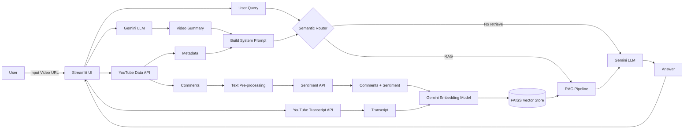
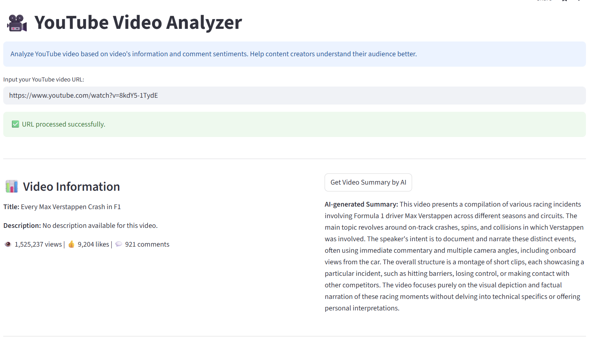
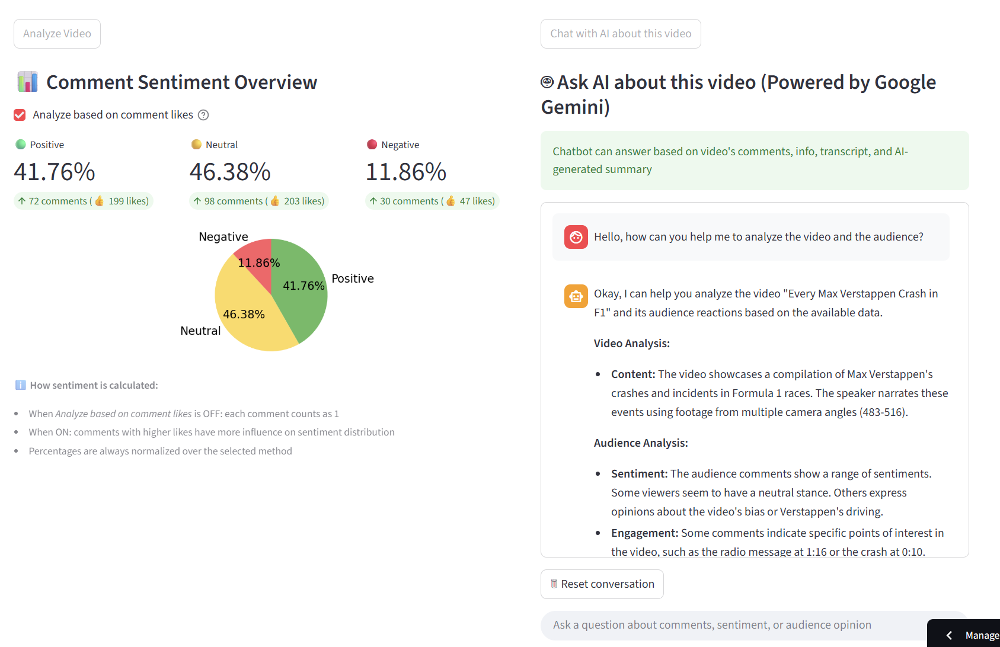

# YouTube Video Analyzer

A simple web application that helps YouTube Content Creators understand their audience better.

[*Demo*](https://youtubevideoanalyzer.streamlit.app/)
---
## Features

- Fetch video metadata (title, views, likes, etc.)
- Collect comments, predict comment sentiment (negative, neutral, positive)
- Create video summary by Google Gemini
- Generate basic statistics and sentiment analysis
- RAG (Retrieval-Augmented Generation) chatbot for Q&A on metadata, comments, transcript, summary

---
## System Architecture

The application follows a Retrieval-Augmented Generation (RAG) architecture.

- YouTube data (metadata, comments, transcript) is collected via API
- Comments are analyzed using a Sentiment Analysis API
- Video is summarized using Google Gemini
- Comments with sentiment and chunked transcripts are embedded into a vector store
- The chatbot retrieves relevant context and generates answers using Gemini LLM



---
## RAG Chatbot

Instead of directly answering user questions, the chatbot:

1. Retrieves relevant information from comments, transcript
2. Injects the retrieved context, metadata, summary into the prompt
3. Generates grounded and explainable answers using Gemini LLM

This approach reduces hallucination and improves factual accuracy.

---
## Installation, Configuration and Usage


### Clone Repository
```bash
git clone https://github.com/KhoaTran235/YouTube_Video_Analyzer.git
cd YouTube_Video_Analyzer
```

### Backend (FastAPI)

```bash
cd backend
pip install -r requirements.txt
uvicorn app:app --host 0.0.0.0 --port ${PORT}
```

### Frontend (Streamlit)

1. Create **.env** file in the `frontend` folder:
```bash
GOOGLE_API_KEY=<YOUR_API_KEY>
SENTIMENT_API_URL=<YOUR_BACKEND_API_URL>
```
2. Install dependencies and run the app:
```bash
cd frontend
pip install -r requirements.txt
streamlit run app.py --server.port=${PORT:-8080} --server.address=0.0.0.0
```
---
## Example


